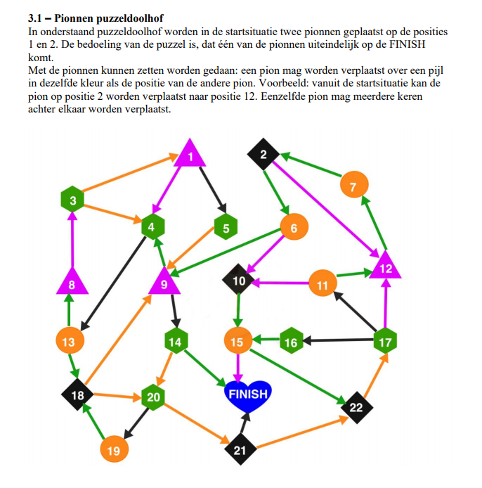

# Code Maze

## Problem

In a maze there are two cones places on position 1 and 2. The goal is for any of the cones to reach the FINISH.

## Rules

A cone can move over a colored arrow that has the same color as the other cone. A cone can also be moved multiple times.

## Solver

[The code that generates the solutions can be found here.](conemaze.py)

## Solutions

 * [solution 1](solution_0.md)
 *  ...